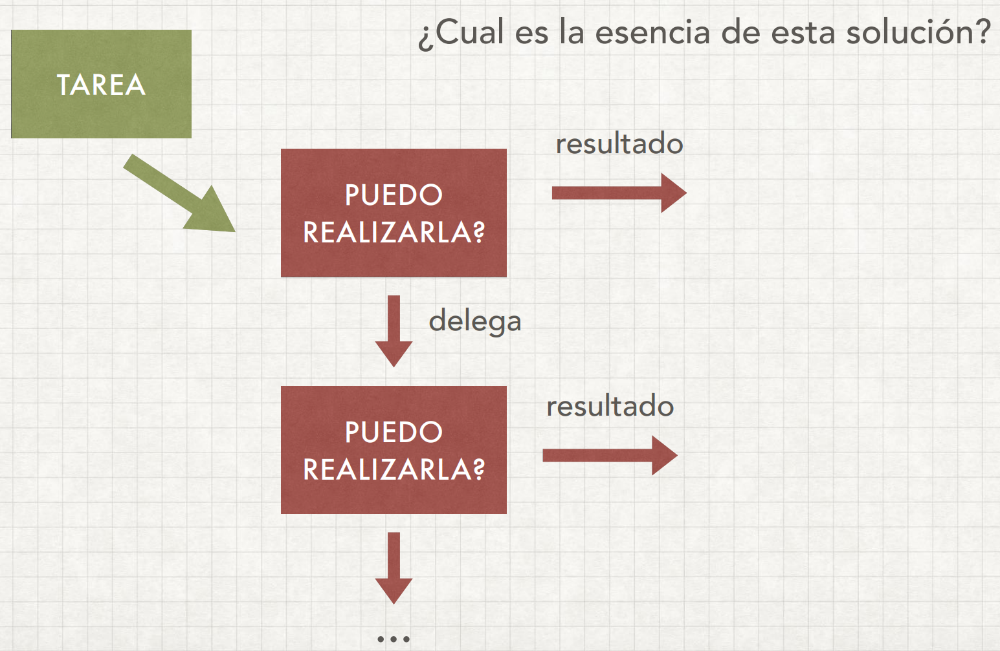
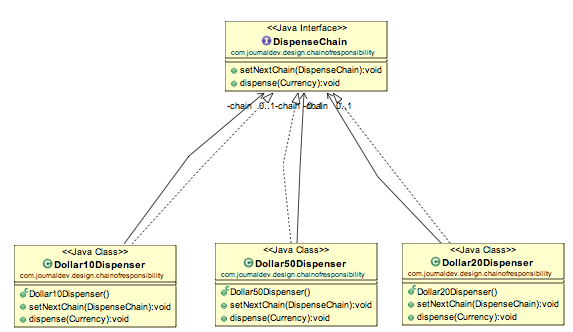

# Chain of Responsibility Pattern

Evita acoplar el remitente de una solicitud a su receptor dando a más de un objeto la 
oportunidad de manejar la solicitud. 
En este patrón, normalmente cada receptor contiene una referencia a otro receptor. En donde el
receptor 
decide si lo procesa o si le pasa al siguiente receptor de la cadena de responsabilidad.

Uno de los grandes ejemplos de este patrón es **_máquina dispensadora de cajero automático_**.

