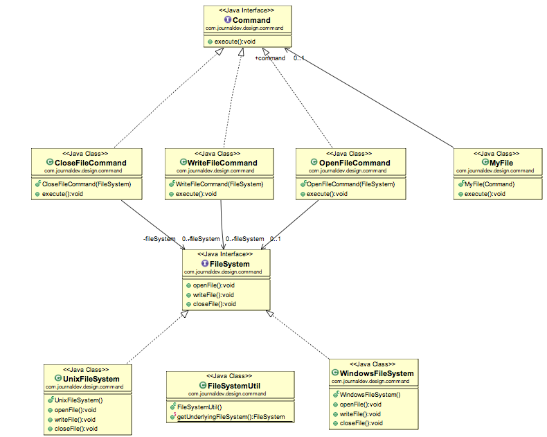

# Command Pattern

En el patrón hay un objeto de comando que encapsula una solicitud al vincular un conjunto 
de acciones en un receptor específico. Lo hace exponiendo solo un método de ejecución, que 
hace que se invoquen algunas acciones en el receptor.

En el patrón la solicitud se envía al invocador (invoker) y se le pasa al objeto command 
encapsulado. El objeto command pasa la solicitud al método adecuado del receptor (Receiver) 
para realizar la acción específica. Ahora cuando el programa cliente llama al invocador, se  
ejecuta la acción según el comando y el objeto receptor.

