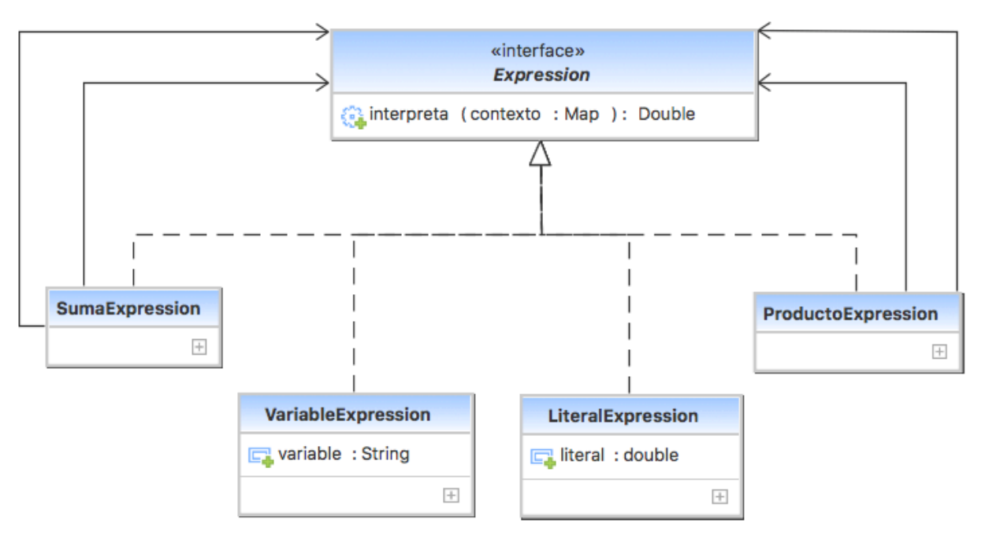
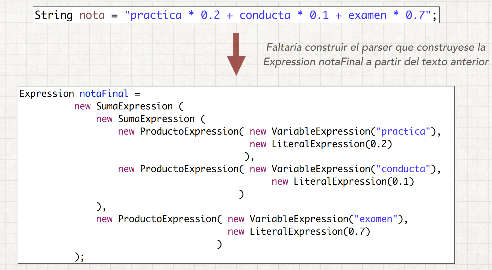
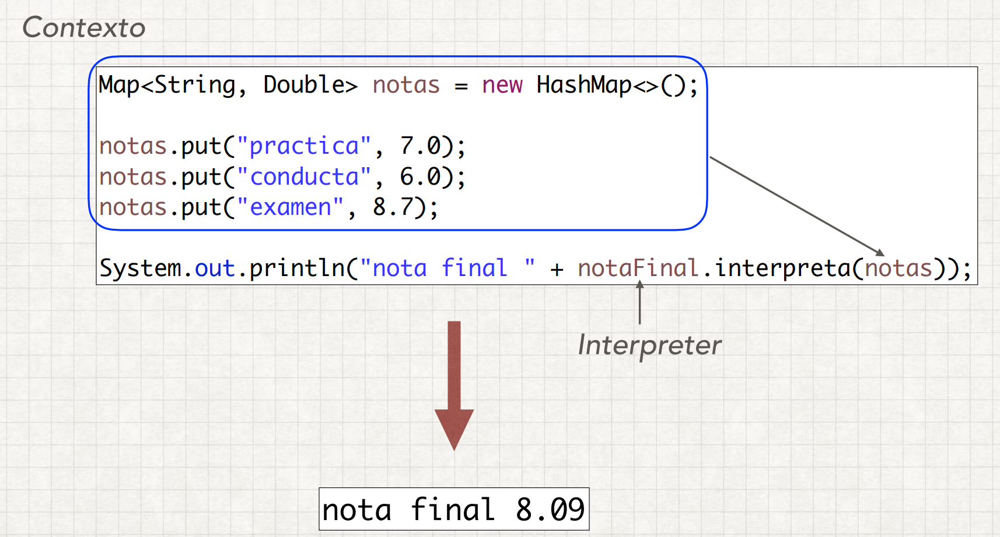

# Interpreter Pattern

Nuestro código disponga de un intérprete que reconozca la gramática de un lenguaje específico 
y sepa como interpretarlo. En resumen, el patrón define la gramática de un idioma en particular 
de una manera orientada a objetos que puede ser evaluada por el propio intérprete.

Este patrón se utiliza en el análisis SQL, el motor de procesamiento de símbolos, DSL, etc.

