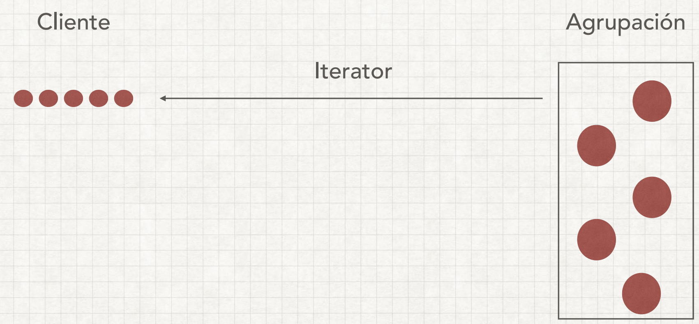

# Iterator Pattern

Se utiliza para obtener una forma de acceder a los elementos de un objeto de colección 
de manera secuencial sin necesidad de conocer su representación subyacente. Es decir, 
oculta la implementación real del recorrido a través de la colección y los programas 
cliente solo usan métodos de iterador.

