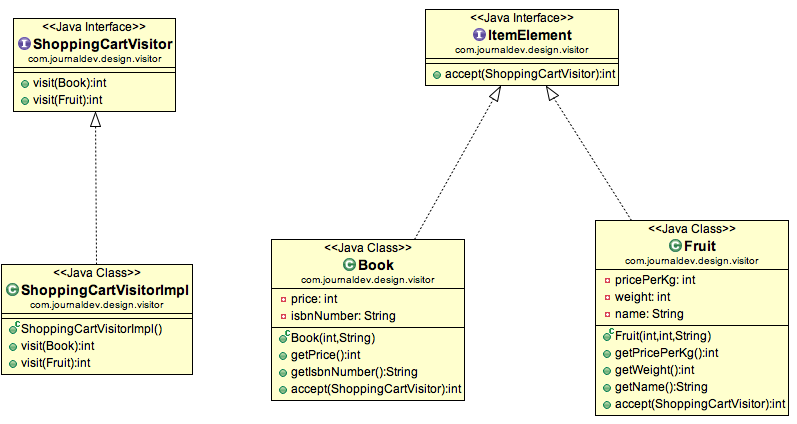

# Visitor Pattern

Se usa cuando tenemos que realizar una operación en un grupo de Objetos de tipo similar. 
Con la ayuda del patrón, podemos mover la lógica operativa de los objetos a otra clase.

