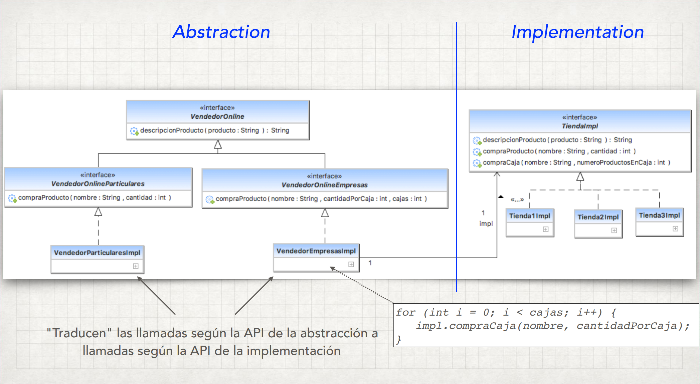
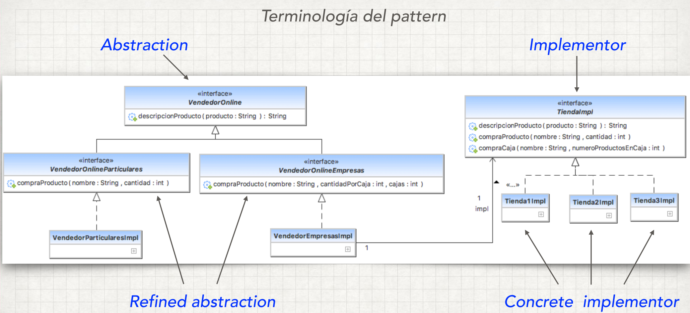

#Bridge Pattern
Se usa cuando necesitamos desacoplar una abstracción de su implementación, para 
que los dos puedan variar de forma independiente. De esta forma, proporcionar una
estructura de fuente entre ellas.

