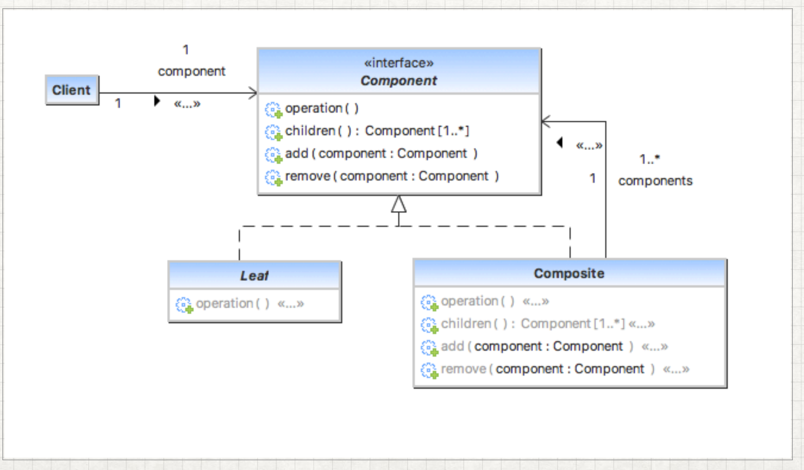

#Composite Pattern
Se usa cuando necesitamos tratar un grupo de objetos de manera similar como un 
solo objeto. Este patrón compone objetos en términos de una estructura de árbol para 
representar una jerarquía parcial y completa.

