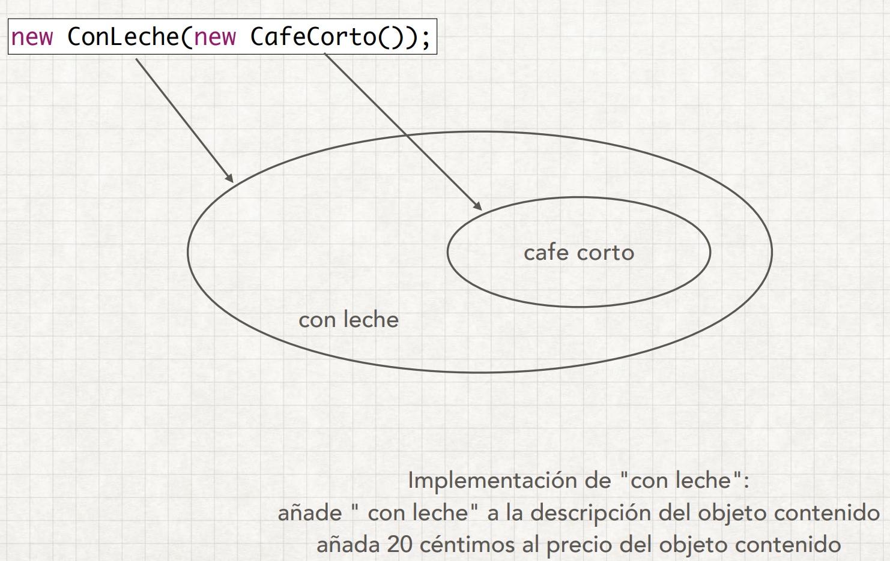

# Decorator Pattern

Permite al usuario agregar nuevas funciones a un objeto existente sin alterar la estructura. 
Este patrón crea una clase de decorador que envuelve la clase original y proporciona una
funcionalidad 
adicional que mantiene intacta la firma de los métodos de la clase.

