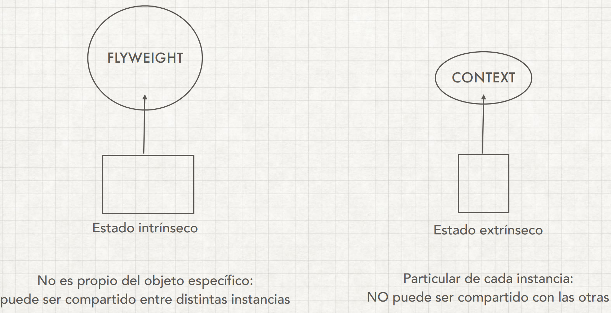
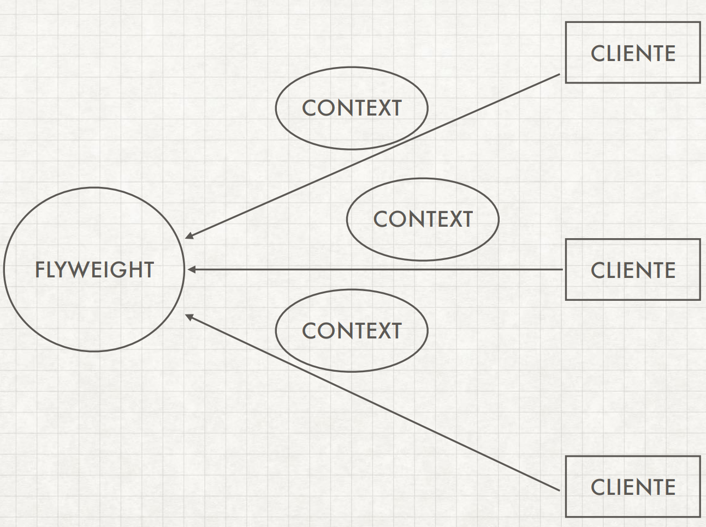
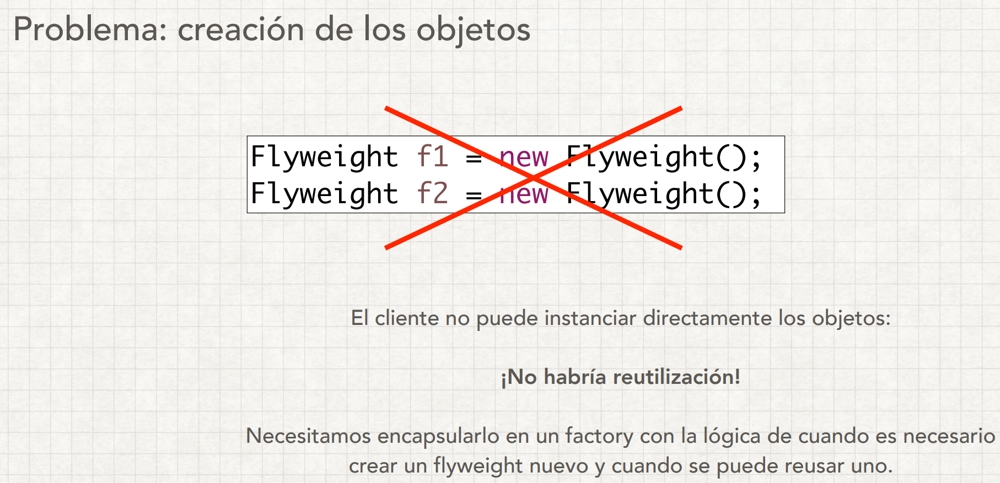
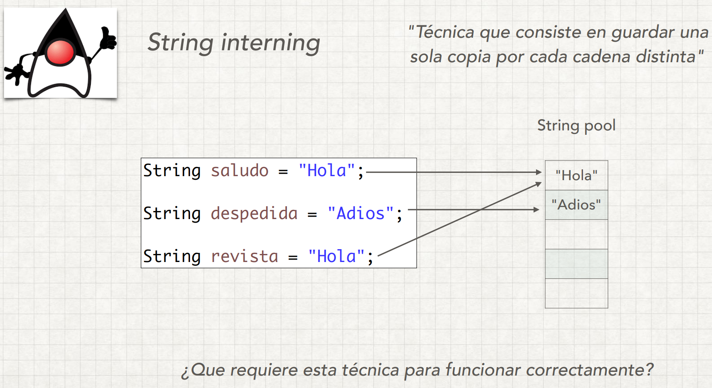
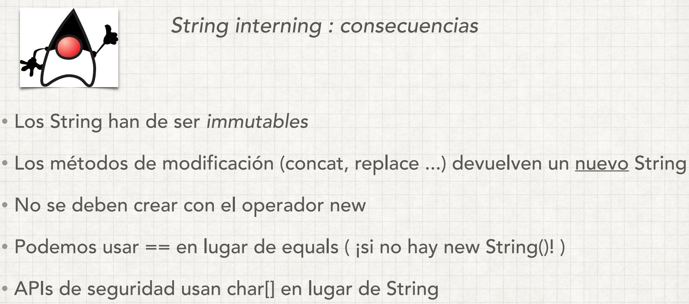

# FlyWeight Pattern

Se usa principalmente para reducir la cantidad de objetos creados y para disminuir el consumo 
de memoria y aumentar el rendimiento. 
El patrón FlyWeight intenta reutilizar objetos de tipo similar ya existentes almacenándolos 
y crea un nuevo objeto cuando no se encuentra ningún objeto coincidente.

Un ejemplo claro de uso de este patrón es la clase String.

