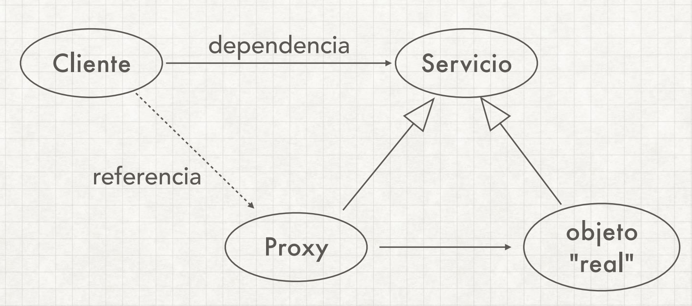

# Proxy Pattern

Proporciona un sustituto para otro objeto para controlar el acceso a él. Es decir, 
El sustituto contendrá el objeto original, al cual le realizará los controles necesarios 
y delegará las llamadas.

